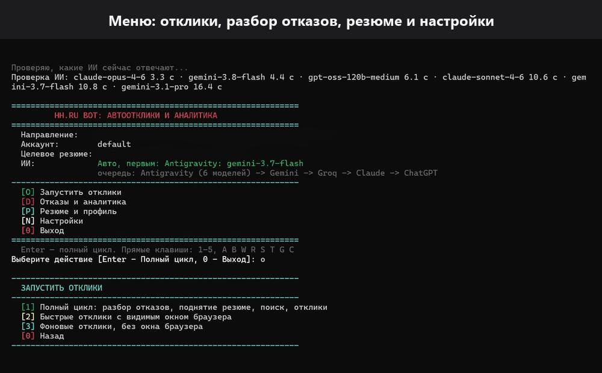

# HH Auto Apply

[](https://www.python.org/)
[](https://www.selenium.dev/)
[](#использование-ии)
[](#запуск-через-docker)
[](https://github.com/madnessbrainsbl/hh-auto-apply)
[](https://github.com/madnessbrainsbl/hh-auto-apply/commits/main)
[](https://github.com/madnessbrainsbl/hh-auto-apply/stargazers)

> [!IMPORTANT]
> Бот бесплатный и работает целиком на вашем компьютере. Ваши логин, резюме, переписка и ключи
> никуда не отправляются, кроме самого hh.ru и выбранного вами ИИ. Исходный код открыт: можно
> проверить.

> [!NOTE]
> hh.ru продаёт то же самое в подписке hh PRO: от 279 ₽ в неделю, 799 ₽ в месяц или 1 499 ₽ за
> три месяца, с автопродлением. Бот поднимает резюме, пишет письма и откликается бесплатно.

> [!WARNING]
> Массовые автоотклики могут противоречить правилам hh.ru. Бот работает через обычный браузер
> с паузами, но ограничения на аккаунт остаются вашим риском.

<div align="center">
  
</div>

### Поддержать проект

[](https://etherscan.io/address/0xdc07c830a2E7A641f28465dc69aaf94e622c64Ed)

**Кошелёк (EVM):** `0xdc07c830a2E7A641f28465dc69aaf94e622c64Ed`

Принимаются ETH, USDT и USDC в сетях Ethereum (ERC-20), BNB Smart Chain (BEP-20), Polygon,
Arbitrum и Base. Донаты двигают разработку: hh регулярно меняет вёрстку, и бота приходится
подстраивать.

> [!CAUTION]
> Это адрес EVM-кошелька. Не отправляйте на него BTC и USDT в сети TRON (TRC-20): такие переводы
> не дойдут.

Не хотите платить, поставьте звезду: так бот проще найти другим соискателям.

---

## Ключевые особенности

- **Полностью бесплатно.** Сервисы автооткликов и hh PRO берут деньги за то же самое каждую неделю.

- **Сопроводительное письмо под каждую вакансию.** Пишет ИИ по вашему профилю и тексту вакансии.
  Очередь ИИ: Gemini, Groq, Claude, ChatGPT, любой OpenAI-совместимый сервис. Кончилась квота у
  одного, пишет следующий. Без ИИ работает шаблон со спинтаксисом, чтобы письма не были одинаковыми.

- **Только правда о вас.** Письма и ответы строятся из вашего профиля. Бот не приписывает опыт,
  которого нет, не выдумывает цифры и не называет сумму зарплаты первым.

- **Заполнение анкет при отклике.** Текстовые поля, радиокнопки, флажки, списки, «Свой вариант».
  Вопросы без ответа бот показывает вам, а не отвечает наугад.

- **Ответы ботам в чате.** Отвечает ботам-ассистентам работодателя, чтобы довести разговор до
  человека. Если в форме отклика нет поля для письма, дописывает письмо в чат.

- **Письмо на почту работодателя.** По желанию дублирует письмо на адрес, указанный в вакансии.

- **Разбор отказов.** Читает переписку, отделяет реальные слова работодателя от догадок и
  собирает отчёт: частые причины отказов и навыки, которых не хватило.

- **Правка резюме.** Заполняет профиль из резюме hh, добавляет в резюме навыки, подтверждённые
  профилем, с учётом лимита hh в 30 навыков. Остальное показывает как рекомендацию.

- **Бесплатное поднятие резюме** раз в 4 часа, по расписанию внутри прогона.

- **Вакансии под ваше резюме в начале очереди.** Бот берёт подборку hh для резюме, а потом ищет
  по выбранному направлению.

- **Фильтры.** Обязательные слова и слова-исключения в названии, нежелательные работодатели,
  отсев вакансий выше вашего стажа, ИИ-фильтр вакансий по вашему описанию.

- **Несколько аккаунтов.** У каждого аккаунта hh свои настройки, сессия и история.

- **Устойчивость.** Обрыв сети не останавливает прогон. Капчу решаете вы, бот ждёт.

- **Работа на сервере.** Прогоны по расписанию в Docker, вход в hh через браузер в окне noVNC.

- **История и статистика** откликов, приглашений и отказов в SQLite.

---

## Содержание

- [Поддержать проект](#поддержать-проект)
- [Ключевые особенности](#ключевые-особенности)
- [Описание](#описание)
- [Установка](#установка)
- [Первый запуск](#первый-запуск)
- [Меню](#меню)
- [Описание команд](#описание-команд)
- [Запуск через Docker](#запуск-через-docker)
- [Использование ИИ](#использование-ии)
- [Данные приложения](#данные-приложения)
- [Ответы на частые вопросы](#ответы-на-частые-вопросы)
- [Разработка](#разработка)
- [От автора](#от-автора)

---

## Описание

Бот откликается на вакансии HeadHunter (hh.ru) за вас: находит вакансии, пишет письмо под каждую,
заполняет анкеты, отвечает ботам-рекрутерам в чате, а потом разбирает отказы и подсказывает, что
поправить в резюме. До 200 откликов в сутки.

> [!NOTE]
> hh.ru закрыл отправку откликов через API для сторонних приложений (`403` на `POST /negotiations`).
> Поэтому бот ищет вакансии через API, а откликается через браузер с вашей обычной сессией hh.ru.

Работает на Windows, Linux и macOS, нужен Python 3.10 или новее и Google Chrome.

> **English:** an auto-apply bot for hh.ru (HeadHunter). It searches vacancies through the hh API,
> applies through a real Chrome session (Selenium), writes a cover letter per vacancy with Gemini,
> Groq, Claude or ChatGPT, answers employer questionnaires, and analyses rejections to suggest
> resume fixes. Runs on Windows, Linux, macOS or in Docker on a schedule.

---

## Установка

```bash
git clone https://github.com/madnessbrainsbl/hh-auto-apply.git
cd hh-auto-apply
pip install -r requirements.txt
```

Обновление до новой версии:

```bash
git pull
pip install -r requirements.txt
```

---

## Первый запуск

```bash
python hh.py menu
```

На Windows можно запускать `menu.bat`, на Linux и macOS `./menu.sh`. Бот сам покажет, чего не
хватает для работы:

1. `[N]` → `[L]` войти в hh.ru. Откроется Chrome, вход вы делаете сами, сессия сохранится.
2. `[P]` → `[R]` выбрать резюме. Бот сразу предложит заполнить профиль из него (`[P]` → `[H]`).
3. `[N]` → `[S]` выбрать направление поиска: Python, DevOps, системный администратор, свой запрос
   или ссылка поиска hh.ru с фильтрами.
4. `[N]` → `[G]` ключ Gemini и `[N]` → `[K]` запасной ключ Groq, по желанию.
5. `[N]` → `[Q]` готовые ответы на частые вопросы, `[N]` → `[M]` поведение бота.

Потом `[O]` → `[1]`: полный цикл с разбором отказов, поднятием резюме, поиском и откликами.

> [!IMPORTANT]
> Без выбранного резюме и направления поиска бот откликаться не начнёт: иначе отклики ушли бы
> не с того резюме или не на те вакансии.

---

## Меню

```text
  [O] Запустить отклики
      [1] Полный цикл: разбор отказов, поднятие резюме, поиск, отклики
      [2] Быстрые отклики с видимым окном браузера
      [3] Фоновые отклики, без окна браузера
  [D] Отказы и аналитика
      [A] Разбор переписки с работодателями и правка резюме
      [4] Почему отказали: разбор причин и проверка резюме
      [5] Статистика откликов и конверсия
  [P] Резюме и профиль
      [B] Поднять резюме в поиске   [W] Профиль и статус аккаунта
      [R] Выбрать резюме            [H] Заполнить профиль из резюме
  [N] Настройки
      [F] ИИ-фильтр и капча   [U] Аккаунты   [L] Вход в hh      [S] Направление поиска
      [T] Письмо и Telegram   [I] Очередь ИИ [G] Ключ Gemini    [K] Запасной ИИ (Groq)
      [Q] Ответы работодателям               [M] Поведение бота [C] Очистить вакансии
```

Во время работы бота: `[P]` пауза, `[S]` остановка, `[I]` статус.

---

## Описание команд

```bash
# Меню
python hh.py menu

# Войти в hh.ru для текущего профиля
python hh.py login

# Один прогон откликов без окна браузера
python hh.py run --headless --limit 100

# Прогоны по расписанию, раз в 4 часа
python hh.py schedule --headless --every-minutes 240

# Список аккаунтов
python hh.py profiles

# Работа с отдельным аккаунтом hh
python hh.py --profile-id work login
python hh.py --profile-id work menu

# ИИ-фильтр вакансий: off, light, heavy, custom
python hh.py run --ai-filter light
```

---

## Запуск через Docker

```bash
# Вход в hh через браузер: откройте http://localhost:6080
docker compose --profile tools run --rm --service-ports auth

# Прогон раз в 4 часа в фоне
docker compose up -d bot
```

Интервал задаётся переменной `HH_INTERVAL_MINUTES`, аккаунт `HH_PROFILE_ID`. Настройки, сессия и
история лежат в томе `hh_data`.

---

## Использование ИИ

**Gemini.** Бесплатный ключ: [Google AI Studio](https://aistudio.google.com/app/apikey). Меню
`[N]` → `[G]` или переменная `GEMINI_API_KEY`.

**Groq.** Бесплатная квота Gemini небольшая, поэтому стоит добавить запасной ключ:
`[N]` → `[K]` или `GROQ_API_KEY` ([console.groq.com](https://console.groq.com/keys)).

**Claude и ChatGPT.** Если установлены и авторизованы Claude Code или Codex CLI, бот использует их
как запасные провайдеры. Порядок очереди меняется в `[N]` → `[I]`.

**OpenAI-совместимые сервисы** задаются списком `ai_config.openai_compatible` в настройках.

**HeadHunter API (быстрый поиск).** Зарегистрируйте приложение на [dev.hh.ru](https://dev.hh.ru/),
Redirect URI `https://localhost/hh-auth`. Ключи задайте переменными `HH_CLIENT_ID` и
`HH_CLIENT_SECRET` и выполните `python reauth.py`. Контактный email для User-Agent задаётся
переменной `HH_CONTACT_EMAIL`.

---

## Данные приложения

Всё хранится у вас в папке программы (у дополнительных аккаунтов в `profiles/<имя>/`):

| Файл | Что в нём |
|---|---|
| `hh_selenium_config.json` | Настройки. Шаблон: `hh_selenium_config.example.json` |
| `chrome_profile/` | Сессия hh.ru в браузере |
| `hh_data.db` | История откликов, отказов и навыков (SQLite) |
| `*.log` | Журналы работы |

Основные настройки (большая часть правится из меню):

| Параметр | Описание |
|---|---|
| `resume_id`, `resume_title` | Резюме, с которого идут отклики |
| `search_preset`, `search_url`, `search_queries` | Направление поиска |
| `topup_enabled`, `topup_search_queries` | Добор по дополнительным запросам до лимита |
| `search_area` | Регион: `113` Россия, `1` Москва ([справочник](https://api.hh.ru/areas)) |
| `max_applications` | Лимит откликов за 24 часа (по умолчанию 200) |
| `keywords_include`, `keywords_exclude` | Обязательные слова и слова-исключения в названии |
| `blocked_employers` | Работодатели, на которых не откликаться |
| `candidate_profile` | Ваш профиль: специализация, стаж, навыки, опыт, контакты |
| `question_answers` | Готовые ответы на короткие вопросы анкет |
| `answer_policy` | «Да» на вопросы об условиях, развёрнутые ответы про опыт |
| `chat_autoreply` | Ответы ботам работодателя в чате и их лимит за прогон |
| `email_outreach` | Письма на почту работодателя (нужен пароль приложения почты) |
| `ai_config` | Провайдер ИИ, модель, ключи |
| `ai_filter` | ИИ-фильтр вакансий: `off`, `light`, `heavy`, `custom` |
| `about_addition` | Текст, который бот допишет в раздел «О себе» |
| `disallowed_resume_keywords` | Слова в названии резюме, с которого откликаться нельзя |
| `grade_filter` | Отсев вакансий выше вашего стажа (по умолчанию выключен) |

> [!CAUTION]
> Не выкладывайте `hh_selenium_config.json`, `chrome_profile/`, `hh_data.db` и токены: там ваши
> ключи, сессия и переписка. Они уже исключены через `.gitignore`.

---

## Ответы на частые вопросы

**Бот ответит на приглашение за меня?** Нет. Приглашения и интервью автоматика не трогает.

**Подойдёт не только для IT?** Да. `[N]` → `[S]` → свой запрос или ссылка поиска hh.ru с
фильтрами. Готовые направления сделаны для IT, остальное работает для любой профессии.

**Кончились вакансии.** Расширьте направление или добавьте дополнительные запросы
(`topup_search_queries`): бот доберёт по ним до дневного лимита.

**Письма пишутся по шаблону, а не ИИ.** Кончилась бесплатная квота. Добавьте запасной ключ Groq
или подключите Claude Code / Codex CLI.

**Появилась капча.** Решите её в окне браузера, бот подождёт и продолжит.

**hh поменял вёрстку и бот сломался.** Откройте
[issue](https://github.com/madnessbrainsbl/hh-auto-apply/issues) с фрагментом
`hh_selenium.log`, предварительно убрав из него личные данные.

---

## Разработка

```bash
pip install -r requirements.txt
pytest tests/ test_questions.py test_rejection_fixes.py
```

Тесты работают на временных файлах и заглушках браузера и не трогают ваши настройки.
Pull request приветствуются.

---

## От автора

Бот доводит до собеседования. Помочь на самом собеседовании может
[Talkaside](https://app.talkaside.workers.dev): приложение для Windows с подсказками по вашему
резюме и описанию вакансии, живым переводом на 27 языков и расшифровкой разговора. Talkaside
платный, есть пробный период на 5 дней. Бот бесплатный.

---

Ключевые слова: автоотклик hh.ru, бот для hh.ru, автоматические отклики HeadHunter, hh auto apply,
замена hh PRO, автоподнятие резюме, сопроводительное письмо ИИ, headhunter bot, job search automation.
